# PowerNXT Transformer Sentinel — Mentor & Judge Demonstration Guide

**Project:** PowerNXT Transformer Sentinel
**Target Repository:** `powernxt-ai-transformer-sentinel` (GitHub: `helloween1947/powernxt-ai-transformer-sentinel`)
**Candidate Source:** [`41252377a0fc62947eeb4c7fc5208f16b2eb2019`](https://github.com/helloween1947/powernxt-ai-transformer-sentinel/commit/41252377a0fc62947eeb4c7fc5208f16b2eb2019) (Branch: `feature/phase4-full-implementation`)
**Verified Candidate Docker Image:** `sentinel-backend:phase5-candidate-42db6aa`

---

## 1. 60-Second Mentor Overview

> "PowerNXT Transformer Sentinel is an explainable digital twin and operational intelligence platform for electrical power substations. Rather than applying black-box heuristics or uncalibrated machine learning, Sentinel combines strict IEEE physical thermal differential equations with transactional telemetry ingestion, durable worker processing, and versioned incident management.
>
> In this demonstration, you will see the full operational lifecycle: high-frequency 3-phase electrical readings enter the system, our worker processes them against an immutable asset configuration, a sustained overload triggers a verifiable incident with immutable evidence snapshots, an authenticated operator acknowledges the issue and escalates it to a linked maintenance task, and our digital twin forecasts the thermal trajectory under alternative load scenarios—all while maintaining complete database immutability and transparent labeling of uncalibrated model assumptions."

---

## 2. Technical Architecture Summary

```mermaid
flowchart LR
    subgraph 1. Ingestion Layer
        SENSORS[3-Phase Sensors / Simulator] -->|JSON POST| API_INGEST[FastAPI Telemetry Ingestion]
        API_INGEST -->|Atomic Deduplication| DB_TELEMETRY[(telemetry_readings)]
        DB_TELEMETRY -->|Enqueued Job| DB_JOBS[(telemetry_processing_jobs)]
    end

    subgraph 2. Analytics & Digital Twin
        DB_JOBS -->|Fenced Claim| WORKER[Durable Analytics Worker]
        WORKER -->|IEEE Model 1.0.2 / 1.0.1| TWIN_CORE[Physical Thermal Engine]
        TWIN_CORE -->|Atomic Flush| DB_RESULTS[(analytics_results & states)]
        TWIN_CORE -->|Sustained Detector| DETECTOR[Threshold / Anomaly Detector]
        DETECTOR -->|Open Incident| DB_INCIDENTS[(incidents & evidence)]
    end

    subgraph 3. Operational Escalation
        DB_INCIDENTS -->|Versioned Ack| OPERATOR[Operator Console]
        OPERATOR -->|Linked Task FK| DB_MAINTENANCE[(maintenance_tasks & audit)]
    end

    subgraph 4. What-If Simulation
        OPERATOR -->|Dual Scenario Request| WHAT_IF[What-If Scenario Engine]
        WHAT_IF -->|Read-Only Simulation| FORECAST[Deterministic Trajectory]
        FORECAST -->|Immutable Snapshot| DB_WHAT_IF[(what_if_snapshots)]
    end
```



### Key Architectural Pillars
1. **Explainable Physics over Black-Box AI:** Constant-load IEEE C57.91 differential thermal models calculate top-oil temperature rises; unavailable metrics (active/reactive power, power factor) are explicitly returned as `unavailable` rather than hallucinated.
2. **Transactional Fencing & Deduplication:** Message UUIDs prevent duplicate ingestion; worker leases prevent concurrent processing race conditions.
3. **Auditability & Provenance:** Every task, state transition, and incident is linked via strict relational foreign keys with immutable evidence payloads and actor tracking.
4. **Database Immutability during Forecasting:** What-if scenario forecasting computes on-the-fly and makes zero modifications to worker queues or live state.

---

## 3. 5–7 Minute Step-by-Step Demonstration Script

### Act 1: The Preserved Baseline & Dashboard (1.5 Minutes)
1. **Open the Live Dashboard:**
   - Navigate to `http://localhost:3000` (running the preserved development frontend).
   - Point out the selected asset (`demo-normal-85203b1018bc498c8b90873f383cc740`), source (`simulator`), and run (`thermal-144c79522cbd4cd092b7718fea4b05fe`).
2. **Highlight Physical Explainability & Provenance:**
   - Show that 3-phase voltages ($V_r, V_y, V_b$) and currents ($I_r, I_y, I_b$) produce calculated apparent power and capacity loading percentage.
   - Point to the **Parameter Provenance** table: every thermal coefficient (`rated_top_oil_rise_c`, `oil_time_constant_min`, `loss_ratio`, `oil_exponent`) is explicitly labeled with its origin (`nameplate` or `assumed`).
   - Show the thermal residual ($T_{\text{measured}} - T_{\text{predicted}}$) and explain that positive residuals indicate running hotter than model expectation.

### Act 2: Isolated Candidate Startup & Operator Auth (1.5 Minutes)
1. **Launch the Repeatable Demonstration Stack:**
   ```powershell
   # Start the candidate stack on isolated ports (55435 for DB, 8802 for API)
   docker compose -p sentinel-phase5-rehearsal -f integration/compose.phase5-rehearsal.yaml up -d
   ```
2. **Demonstrate Operator Authentication:**
   - Execute the local probe or open the candidate UI pointing to `http://127.0.0.1:8802`.
   - Show the `OperatorAuthBar` where an authenticated token (`admin_rehearsal`) verifies operator role and session expiration against `/api/v1/operators/me`.

### Act 3: Sustained Overload Detection & Incident Triage (1.5 Minutes)
1. **Stream Ingestion & Worker Trigger:**
   - Ingest high loading telemetry ($190\text{ A}$, $\sim 151\%$ rated capacity) for a configured transformer (`tx-p5-...`).
   - Show the worker claiming the job and transitioning condition status to `overload`.
2. **Incident Console (`BackendIncidents`):**
   - The incident appears immediately with category `overload`, condition status `active`, and version 1.
   - Expand the **Event Timeline**: show the initial `condition_status_changed` event.
   - Open the **Raw Evidence Inspector**: show the captured electrical metrics, oil temperature, and threshold limit payload.
3. **Version-Controlled Acknowledgement:**
   - Enter reason *"Investigating high substation load"* and click **Acknowledge**.
   - Notice the incident version increments to 2, stamped with the operator's actor UUID and timestamp.

### Act 4: Maintenance Escalation & What-If Simulation (2 Minutes)
1. **Escalate Directly to Maintenance:**
   - Click **Create Maintenance Task** from the incident view.
   - Show that the resulting task in `BackendMaintenance` is linked via relational foreign key to the incident ID (`alert_source: "analytics"`).
   - Assign the owner to *"Field Crew Alpha"* and update status to `in_progress`. Show the audit history record capturing the transition.
2. **Live What-If Scenario Forecasting (`BackendWhatIf`):**
   - Select the overloaded asset and configure a 1-hour horizon ($3600\text{s}$) at ambient $35^\circ\text{C}$.
   - **Baseline Scenario:** Maintain existing overload ($1.2\text{ pu}$). Final temperature reaches $78.43^\circ\text{C}$.
   - **Reduced Load Scenario:** Dispatch demand response to curtail load to $0.8\text{ pu}$. Final temperature drops to $72.40^\circ\text{C}$.
   - **Observation:** Net cooling benefit of $-6.03^\circ\text{C}$.
   - Point to the prominent banner: *"Conditional healthy-model estimates under constant-load assumptions. Uncalibrated default parameters; not an operational safety guarantee."*
   - Prove database immutability: zero worker queue writes or state modifications occurred during the simulation.

---

## 4. Likely Questions & Evidence-Backed Answers

### Q1: "Are these physical models calibrated against real field transformers?"
> **Answer:** No, and we are completely transparent about that. The physical equations use standard IEEE C57.91 exponential oil rise formulas, but all parameters (such as `rated_top_oil_rise_c` and `oil_time_constant_min`) carry explicit provenance labels marking them as `assumed` or `nameplate`. We explicitly state in the UI and API responses that these are "Conditional healthy-model estimates" and do not represent a calibrated physical accuracy guarantee.

### Q2: "Why isn't the live development stack running the latest candidate code yet?"
> **Answer:** In engineering projects with critical infrastructure models, code must not be blindly deployed without formal review and approval. While the candidate code is 100% complete and verified (passing all 351 backend tests and 55 frontend tests), our governance process requires formal peer reviews on GitHub (PRs #32, #33, #29) and explicit authorization before upgrading the live stack. We have thoroughly rehearsed the upgrade on an isolated copy, proven 100% data preservation, and prepared a turnkey rollback procedure.

### Q3: "How does the system prevent duplicate telemetry from corrupting analytics?"
> **Answer:** We enforce a strict unique constraint on `(asset_id, source, run_key, message_id)`. If an identical message is re-sent, the database rejects it with an atomic conflict, returning the existing receipt without advancing worker leases or corrupting the stream watermark.

### Q4: "What happens if a worker crashes during incident evaluation?"
> **Answer:** Jobs are claimed using durable database leases (`lease_until`). If a worker terminates unexpectedly, its lease expires, and the recovery monitor automatically resets the job for retry. If it was mid-transaction, PostgreSQL rolls back all partial writes atomically.

---

## 5. Repeatable Local Demo Setup Script

To run the complete 10-step automated demonstration end-to-end on any workstation:

```powershell
# 1. Start the isolated demo stack
docker compose -p sentinel-phase5-rehearsal -f integration/compose.phase5-rehearsal.yaml up -d

# 2. Run the deterministic probe (creates local asset, ingests data, acknowledges incident, creates task, runs what-if)
py -3 "C:\Users\marka\.gemini\antigravity\brain\90c1d81b-32dc-449d-bbea-f68729a02067\scratch\probe_phase5_rehearsal.py"

# 3. Clean up when finished
docker compose -p sentinel-phase5-rehearsal -f integration/compose.phase5-rehearsal.yaml stop
```
