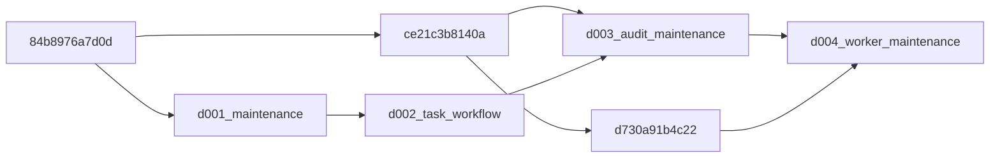

# Person A review of Person D backend — 9 October 2026 (IST)

## Reviewed refs and access

- PR9 Git pull ref / `persond`: **087a884e31c7942330f3cf599aa190b916bfff1e**.
- Current fetched main: **9d2f9cda817bc6312d00a4fc001050b04b85a2cb** (merge of analytics-worker PR11).
- Audit PR8 merge is in main at **59f960432168dbe62e96ba6f107ce5ae92c323df**. Git commit/ancestry confirms this; it is no longer merely reported.
- PR10 Git pull ref: **094c36416d2508095c591e19e51cee751280b564**. Its three-dot diff from PR9 adds five frontend proposal files (component, mount patch, client, client tests, browser verifier). These were not merged or browser-tested here.
- Supplemental A-owned branch: `fix/persond-main-integration`, based on D's tip and locally combined with current main. This local integration merge changed only the A review branch; D's branch/main and all PRs remain untouched. A supplemental draft should target `persond`, so D can review/incorporate the refresh and fixes without a competing PR reproducing D's maintenance work.

GitHub PR GraphQL, REST PR9 metadata and reported workflow-run37911449104 returned **Forbidden**. Git pull refs and main commits were accessible. Draft flag, PR base, reviews, mergeability metadata and hosted CI conclusions could not be independently read. The user/D report draft PR9 targeting main,173 combined tests and passing CI; those are retained as reported historical evidence, not newly verified hosted results. CONTRIBUTING was read; no applicable AGENTS.md was found. Policy requires CI and at least one teammate approval, which this report does not manufacture.

## Findings and focused fixes

1. **Merge blocker: current main registration conflicts.** Combining PR9 with current main conflicts in API/model registration. Retain analytics routes/state/result models alongside maintenance routes/task/history models. No route or metadata may be lost. The A integration branch resolves both and checks OpenAPI contains telemetry, analytical-result and maintenance/history paths.
2. **Merge blocker: two final migration heads.** D003 correctly joins `ce21c3b8140a` and `d002_task_workflow`; it is a no-op, and their DDL concerns are disjoint. But main now has worker revision `d730a91b4c22`, also descended from ce21. Current main+PR9 has heads D003 and d730. Add **d004_worker_maintenance**, a no-op join of those two heads, retaining D003/applied parent history unchanged. No stamp, rewritten parent or dropped data hides conflicts. Metadata consistency checks inspect the combined schema; row snapshots separately verify preservation and configuration guards.
3. **Input bug: nonfinite JSON returns500.** POST `{\"alert\":NaN,\"action\":\"Inspect\"}` and PATCH `{\"expected_version\":1,\"notes\":NaN}` both reproduced500 before fixes (no database queries required). Maintenance lacked the shared finite-JSON guard used by A's other write APIs. Add it to POST/PATCH; eight regression cases require422 for NaN, ±Infinity and overflowing1e999.
4. **Migration-test reliability.** The snapshot helper used `ORDER BY 1::text`, a constant, rather than deterministic row ordering. Use JSONB ordering. Move the graph assertion inside its cleanup try/finally so a head mismatch cannot skip removal of that test's own schema. Extend upgrade starting states and add real worker-result/state preservation coverage. Initial pre-fix execution created empty isolated test schemas before the old assertion's cleanup; they were left untouched rather than sweeping unknown namespaces.

## Backend review assessment

D's service uses the shared SQLAlchemy session dependency and registered asset FK/parent lock. Task creation and initial history commit atomically, with one task per `(asset_id,sample-source,sample-alert-id)`. PATCH row-locks the task, checks strict positive expected_version, rejects stale writers with409, validates transitions/owner/terminal notes, increments version and inserts history in the same transaction. Failure tests demonstrate task/history rollback together. Lists/history have bounded limits and deterministic ordering; task IDs use UUID validation. SQLAlchemy failures are masked, and version/status conflicts have explicit codes/messages. No API route deletes history.

Creation retry checks current owner if explicitly supplied; omitted owner preserves earlier create requests after assignment. This is D's documented/tested prototype contract, not an immutable original-create payload fingerprint. Creation history truthfully has no actor; migrated history is legacy_import; updates record demo_header. History is append-only through supported API operations, **not database-tamper-proof authenticated audit evidence**.

Shared settings, session lifecycle, CORS middleware, registry and telemetry semantics from main are retained. New status enums/analytics endpoints remain available. Actual OPTIONS tests permit localhost5173 PATCH with content-type/X-Demo-Actor and reject an unconfigured origin. CORS is not authentication. No new dependency or unrelated production feature was introduced. Person C's actual browser integration is not proven by these HTTP/ASGI tests; PR10 still needs its own review.

## Migration graph and actual execution

D standalone source lacks the audit parent file (supplied by main), so its standalone Alembic graph fails with missing ce21. This is a branch integration dependency, not proof that D003 itself is wrong. Current-main combination supplies that file and demonstrates the two-head problem. With the supplemental join, **one intended final head is d004_worker_maintenance**. D001 creates maintenance tables; D002 adds workflow/history; ce21 protects immutable configurations; d730 adds worker job/state/result storage. There are no overlapping table/column/constraint modifications between maintenance and worker. `alembic check` reports no unexpected metadata drift on combined upgrade paths. It does not inspect triggers, so existing direct SQL immutability tests remain necessary.

New Linux executions with Python3.12 and PostgreSQL16, selected `sentinel_test`, unique fixture schemas and uniquely named throwaway fresh databases:

| Check | Actual result |
|---|---|
| Combined main+D before final join |39 passed,7 failed,163 fixture errors; expected two-head failure, not a usable suite pass |
| Resolved registration + D004 join |209 passed |
| Added input/preservation regressions |220 passed |
| Final suite `python -m pytest backend/tests -q --tb=short` |**222 passed**,222 deprecation warnings,49.40s |
| Fresh PostgreSQL database upgrade |Passed; one final head; only that uniquely created test database removed |
| Migration starts fresh/84/ce21/D001/D002/both old heads/D003/d730 |Passed, preserving every original stored column and adding only documented fields/history |
| Real worker results/state + maintenance version/history preservation |Passed across worker/D003 combined states; one head and `alembic check` passed |
| Shared finite-JSON/CORS/route regressions |Passed |
| D maintenance mapper Node tests |3 passed; no browser execution |
| Offline `alembic -c backend/alembic.ini upgrade head --sql` |Exit0; combined SQL inspected |

Full tests also cover registry, telemetry, simulator, durable worker and D's task concurrency/conflict/history/persistence cases. Fresh application processes retrieve persisted task/history in D's tests. No new Docker, Windows, browser or production deployment success is claimed. Development cloud containers were not restarted or migrated; `.env`, unrelated work and database volumes were preserved.

## Genuine alert/incident and identity boundary

**Confirmed implemented interfaces:**

- `maintenance_tasks` stores a task UUID, registered `asset_id`, labelled sample alert snapshot (`source=sample`, `sample-...` ID, summary), action/status/owner/notes/version. `maintenance_task_history` records versions and untrusted demo attribution. No genuine-alert FK exists.
- Current backend persists readings, analytical results and model states. Worker `anomaly_observations` are instantaneous configured-limit comparisons with units/availability, **not incident records with a durable incident identity/lifecycle**. Reading ID/message UUID, result ID, sample alert ID and proposed event_id are distinct identities and must not be substituted for a genuine incident ID.
- Tasks reject genuine source labels; PATCH requires caller-supplied `X-Demo-Actor`. This is a prototype label, not an authenticated operator/session. Owner is likewise a display string, not a trusted user reference.
- No implemented alert ingestion endpoint, incident store, alert outbox/queue/WebSocket transport or trusted session/authentication connects B's observations to D's tasks. The event contract remains a proposal, not evidence of delivery.

**Proposed team agreement, not implemented:**

1. A owns PostgreSQL persistence/API; A+B define a durable incident registry with one canonical immutable incident ID per lifecycle, bound to the registered asset and full device/simulator/replay stream. Prefer a backend-assigned UUID and an asset/incident binding that task creation validates with a FK/server lookup. Decide observation-to-incident aggregation, reopening/recovery and deduplication before choosing identity semantics. Do not use one fresh UUID per telemetry observation as a lifecycle ID.
2. Incident evidence should reference reading/configuration and analytical-result IDs, measurement/arrival/evaluation times, model/detector/policy/parameter versions, rule/threshold/observed values with units, channel quality, source/run, provenance/limitations and lifecycle status. Simulation labels stay outside detector inputs. Retain evidence/revisions so task snapshots do not masquerade as the current incident state.
3. Agree detector-worker -> transactional incident/outbox storage as the internal transport before exposing genuine task creation. Current computation is in-process and pure; external authenticated alert ingestion, if chosen instead, needs a separately reviewed versioned envelope/idempotency/auth contract. No browser-provided real-alert snapshot should be treated as authoritative. Task completion must not implicitly acknowledge/recover an incident.
4. A/C/D must choose trusted operator/session authentication and stable subject IDs with authorization. Server-verified session/token identity should determine actor; assignment should reference real authorized operators. Do not promote X-Demo-Actor or CORS into authentication. Roles, asset scope, attribution of creation/update and session expiry/CSRF policy require agreement.

Those proposals are **questions/decisions still requiring team agreement**, not a newly confirmed genuine-alert contract. This review does not implement incident/auth features or contact teammates.

## Ready-to-send handover to D

Your PR9 tip087a884 was reviewed against main9d2f9cd, which now includes PR11 as well as audit PR8. D003 is a valid historical audit/maintenance join, but worker main creates a second head and route/model registration conflicts. A prepared `fix/persond-main-integration`, refreshing main locally and retaining both APIs/models, with additive D004 joining worker+D003. POST/PATCH also need the shared finite-JSON guard: invalid NaN requests reproduced500 and now return422. Applied migrations were not rewritten, and your branch was not changed.

Final isolated PostgreSQL suite:222 passed, including actual fresh database upgrade, eight upgrade start states, row preservation, populated worker results/state and maintenance/history coexistence, metadata consistency, CORS and route checks. Earlier173/CI results remain your historical report; hosted GitHub verification was Forbidden. Please incorporate/review the supplemental changes, update PR9 to current main and run CI on its new exact commit. PR9 **as currently published is not technically ready for approval/merge**; after those fixes and green current CI it is suitable for human review as a sample/demo maintenance milestone. Genuine incident identity, persisted provenance/transport and trusted operator authentication remain prerequisites for production alert-driven maintenance. PR10 contains the separated frontend proposal; no new browser approval is given here. No PR was merged or deployment performed.
