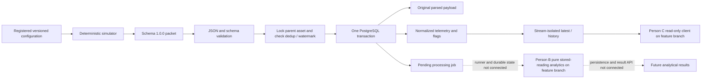

# PowerNXT Transformer Sentinel — correctness audit

## Delivery verification — 2026-10-09T11:55:08.743232+05:30

This section records new Linux executions for `audit/correctness-fixes`; the October 8 audit below is retained as historical evidence. Its statements about uncommitted changes and the old branch base describe that earlier snapshot. The delivery branch now contains fetched main `f35d268cda49d81fac7463d8a5082cb5b1c1bc98` plus the corrections. Git commit/push identify the delivered revision; [structured evidence](project-correctness-evidence.json) records hashes of the six runtime/migration files actually executed, avoiding an unverifiable self-referential commit claim.

### Corrections and migration review

Strict finite ratings reject strings and booleans while accepting valid JSON numbers. UTC normalization overflow and nonfinite JSON produce HTTP 422. The original parsed payload remains available to ingestion. Shared request validation introduces no successful-response shape changes. Host PostgreSQL defaults use 5433, container connections remain `db:5432`, and CORS examples use JSON arrays. Root `.dockerignore` applies to Compose's actual repository-root build context, excluding credentials/cache/generated data while retaining required backend sources and the example configuration. Simulator phase offsets of ±2% mean a 4% R-to-B spread.

Migration `ce21c3b8140a` extends `84b8976a7d0d`. Its trigger rejects both UPDATE and DELETE with SQLSTATE 23514; new configuration versions remain insertable. The function and table are explicitly schema-qualified and identifier-quoted, using online `current_schema()` so isolated test schemas cannot accidentally bind to public. Offline SQL uses `version_table_schema` when configured, otherwise public. No existing rows or columns are rewritten. Downgrade removes the trigger/function and preserves rows, but permits subsequent configuration mutation: it therefore weakens the historical-reference guarantee. Application rollback does not require dropping this guard; use a reviewed maintenance procedure if database downgrade is necessary.

### New execution evidence

- `python -m pytest backend/tests -q`: exit 0, **128 passed**, 100 warnings, 12.72 seconds; isolated PostgreSQL fixture schemas. This includes a new populated upgrade/downgrade regression comparing every stored column of assets, configurations, readings and jobs, both mutation guards, legitimate new versions and identical retries.
- Targeted Ruff, formatting checks and `git diff --check`: exit 0. Offline `alembic -c backend/alembic.ini upgrade head --sql` and `downgrade ce21c3b8140a:84b8976a7d0d --sql`: exit 0.
- Existing isolated stack `correctness_audit_e8354c97`, API port 18001: downgrade to `84b8976a7d0d`, source-image rebuild, upgrade to head all exit 0. Full row snapshots before/after matched for **3 assets, 4 configurations, 7 readings and 7 jobs**. Direct UPDATE and DELETE then rejected with 23514; all configurations remained unchanged.
- `python -m integration.verify_asset_registry --base-url http://127.0.0.1:18001`: exit 0. New asset `demo-registry-c74d370758de4a23916317c0e654ebb1`, versions 1/2 and restart persistence passed.
- `python -m integration.verify_telemetry_ingestion --base-url http://127.0.0.1:18001`: exit 0. New asset `demo-telemetry-ba59fc5705554468976d8f50ba30939b`, reading/job 8, identical resubmission and restart persistence passed with one reading/job.
- `python -m integration.verify_normal_operation_simulator --base-url http://127.0.0.1:18001`: exit 0. New asset `demo-normal-a1e13faf869746358c05b9fc9f12fc36`, six created, six identical retries, six readings/jobs, latest `2026-01-01T00:05:00Z` (reading 14), analytics pending, default device history empty.
- Isolated `alembic current`: head `ce21c3b8140a`; `alembic check`: exit 0, no new upgrade operations detected. This checks metadata drift; direct SQL assertions separately verify the trigger Alembic autogeneration does not inspect.
- All six changed runtime/migration files matched the isolated container byte-for-byte. Existing `.env` and five unrelated documents matched their saved original hashes. Development containers retained their original October 8 start times; no development restart or migration occurred.

These integrations used a clearly identified **reused-dependency image**: an existing backend image's installed dependencies plus current backend sources. They do not establish a successful fresh dependency build. Demonstration data and isolated volume are retained; only that isolated stack is stopped normally after verification. Generated simulator datasets are ignored and not committed.

### Clean build and external checks

The normal command `docker build --pull --no-cache --progress plain -f backend/Dockerfile -t powernxt-correctness-clean:20261009 .` failed (exit 1; apt exit 100) because `deb.debian.org` could not resolve. Fresh retries with the existing proxy arguments still lacked container DNS. Supplying the execution proxy's existing host mapping allowed apt/curl installation, then official PyPI failed TLS verification: `SSLCertVerificationError: self-signed certificate in certificate chain`. The official Python image lacks this execution proxy's trust chain. No confirmed Dockerfile defect, dependency bypass, TLS disablement or untrusted mirror was introduced. **A normal clean build remains unresolved** and must pass in an environment with working DNS and trusted network access before approval.

GitHub PR lookup (GraphQL) and hosted workflow lookup (REST) returned Forbidden. Reviews and hosted CI are unknown, not passed. The prepared [PR description](correctness-fixes-pr.md) and [compare link](https://github.com/helloween1947/powernxt-ai-transformer-sentinel/compare/main...audit/correctness-fixes) support manual draft creation if API access remains unavailable. No merge or auto-merge is authorized.

### Compatibility and deployment handoff

Person B can continue consuming normalized telemetry and explicit configuration versions; no detector/analytics fields, processing lifecycle, or ground-truth inputs were added. Code must append a configuration version instead of updating/deleting history. Person C's successful read-response contract is unchanged; editors must send finite JSON numbers rather than numeric strings/booleans. These are compatibility implications from source review; the previous B/C branch tests below were **not rerun** in this delivery task. Previously user-reported Windows registry/simulator checks remain historical reports and do not prove this revision.

After review and merge: preserve local work, fetch/update main, build backend normally, stop backend writers, apply the reviewed migration, start backend, verify readiness/current/check, then run unique demonstration integrations. [Exact PowerShell commands](correctness-fixes-windows.md) implement this order and explain normal restarts. Existing development backend/database here remain unchanged at migration `84b8976a7d0d`; they do **not** contain these fixes. No additional shared contract decision is introduced; a clean build and unavailable hosted checks remain delivery limitations.

## Historical audit — October 8 (retained verbatim)

Recorded **2026-10-08T23:49:28.157673+05:30**, timezone **Asia/Calcutta (IST, UTC+05:30)**. Execution is **Linux cloud**, not Windows. Original checkout: `/workspace/powernxt-ai-transformer-sentinel`; audit fixes/reports: `/workspace/powernxt-correctness-audit`. The Windows path supplied by the user is inaccessible from this environment.

## Assessment

The registry, transactional telemetry ingestion and normal-operation simulator are implemented and merged. Their baseline **115 tests were newly reproduced**, and the corrected local worktree passes **127 tests**. Actual isolated Docker verification proved registry/configuration persistence and telemetry deduplication/job persistence through normal restarts, plus the six-reading simulator sequence with isolated history. These are concrete data-admission achievements, not a completed deployed digital twin.

There is now executable analytics on Person B's unmerged branch, including a conservative stored-reading computation entrypoint and independent numerical/contract tests. Its combined suite passed **161 tests** with the simulator export enabled. Person C's unmerged frontend has a real read-only registry/telemetry client; lint, build and six adapter tests passed, and an actual API response passed through that adapter. No browser session was exercised. Durable job scheduling, processed state/results, result retrieval, live events and shared maintenance remain unwired.

Confirmed defects were fixed locally: strict finite configuration numbers, UTC overflow validation, nonfinite registry JSON error handling, usable environment defaults, active Docker context exclusions, and database protection against rewriting configuration versions. Fixes are **uncommitted, unpushed and not applied to the existing development services/database**. A new migration was applied only to isolated test schemas and the isolated audit stack. See [summary](project-correctness-summary.md) and [structured execution evidence](project-correctness-evidence.json).

## Repository and review state

Original branch is `feature/normal-operation-simulator`, HEAD `55a9c54f44f9f7dc6cdc437438bce9fcc11c1bba`. It had these pre-existing local changes, which remain preserved byte-for-byte:

```text
 M docs/normal-operation-simulator-pr.md
 M docs/normal-operation-simulator-verification.md
?? docs/person-c-backend-handoff.md
?? docs/project-progress-audit.md
?? docs/project-progress-summary.md
```

The existing `.env` and those five documents were hashed before/after; all matched. No original branch switch/reset, existing-file replacement, commit, push, force-push, merge or deployment occurred. Read-only fetch updated remote refs. An isolated worktree was created on `audit/correctness-fixes`, based on `55a9c54`; its working changes are the fixes described below. This base has the **same source tree** as current main `f35d268cda49d81fac7463d8a5082cb5b1c1bc98` (tree `abc24e63743ffd9d62cfb44e726fad563ce39381`). No AGENTS.md was found in readable workspace paths; `CONTRIBUTING.md` was inspected. Shared interface decisions below are recorded for owners rather than silently changed.

Ref snapshot after fetch:

```text
origin f35d268cda49d81fac7463d8a5082cb5b1c1bc98
origin/chore/team-repository-setup 2619044900e0e0fd1ec76d151559d1ecf868342a
origin/feat/frontend-api-integration a55478654d5cb945ccf4d7134add131314e5a7cd
origin/feat/frontend-setup cc7678c65ce91db526d1f1b93feb70d4319e0aa4
origin/feature/asset-registry b9d1c5d6722887f40941490ddb69207568f911c0
origin/feature/normal-operation-simulator 55a9c54f44f9f7dc6cdc437438bce9fcc11c1bba
origin/feature/personb-twin-analytics 35a8c64b5a2b5eaf37b84e6cd1308a7a3576fe28
origin/feature/telemetry-ingestion db17a8d8a6f079353bb9795c1eba193d9978e7d3
origin/main f35d268cda49d81fac7463d8a5082cb5b1c1bc98
origin/personc c9e3f0d8a4dafea954a1617baea8455f992bf509
origin/persond c9e3f0d8a4dafea954a1617baea8455f992bf509
```

Git main records PR #3 registry, PR #4 telemetry and **PR #6 simulator** merges. The simulator is no longer merely feature-branch code. B's `35a8c64` and C's `a554786` are not ancestors of main (ancestry checks exit1), and were inspected in archives without switching the original checkout. `personc` and `persond` point to `c9e3f0d…` and contain only `.gitignore`/README, not their implemented named feature branches.

GitHub `gh pr list --state all` returned GraphQL `Forbidden`; `gh run list` returned REST `Forbidden`. Merge evidence comes from Git commits/ancestry. Actual review decisions, PR descriptions and hosted CI conclusions are **unavailable**, and no approval is inferred. B's branch contains a simulator-review document accepting limited synthetic assumptions and recording unresolved decisions; this is source-level review evidence, not proof of a GitHub approval.

Tool versions: Python3.12.14, Node24.19.0, npm11.9.0, Docker28.4.0, Compose2.40.3. Existing development backend/db were already running; the backend has no Compose healthcheck, but direct live/ready probes return200. PostgreSQL has its configured healthcheck. No Windows execution connector or PowerShell runtime is attached.

## Architecture and where processing stops



The live API implements eight paths: health live/ready, asset collection/detail/configuration history, POST telemetry, latest telemetry and telemetry history. There is no worker consumer, analytics-result endpoint or job completion route. `telemetry_processing_jobs.status` is constrained by PostgreSQL to `pending`; no code changes that status. B's `analytics/worker.py` is a **pure computation function**, explicitly doing no storage/job writes; its filename does not imply a deployed worker.

## Backend and database review

**Startup/settings/errors.** FastAPI factory installs explicit CORS and routes; lifespan configures logging, emits application startup/shutdown, and does not run migrations or analytics. Readiness executes `SELECT 1`, so it proves connectivity, not schema currency or analytical readiness. Sessions are request-owned, closed in `finally`; service writes flush/construct responses/commit once. Route dependencies roll back known domain and SQL errors, returning sanitized404/409/422/503 without driver messages. Existing tests inject private error text and verify it does not escape. Connection timeout is3s; `check_db_health(timeout_seconds)` does not configure a per-statement deadline and pool waits are separate—no claim of a hard3s end-to-end readiness bound is made.

**Registry.** Asset IDs/timezones, positive ratings, measurement side/convention and complete provenance are validated. Configuration unknown thermal parameters remain null. Parent-row `FOR UPDATE` serializes version allocation; a unique `(asset_id,version)` constraint independently enforces uniqueness. Eight concurrent API writers are tested to produce consecutive versions. Existing API has no configuration update/delete routes. Baseline direct SQL could still mutate a historical version: the isolated baseline reproduction rewrote rated_kva to999 and the same version's API history changed. New local migration blocks row UPDATE/DELETE and leaves append/new version behavior intact. Schema owners can still deliberately disable guards or change schema; this is not a replacement for database privileges/backups.

**Telemetry validation/normalization.** UUID4/schema1.0.0, identifiers, source/run rules, explicit positive configuration version, finite numeric channels, producer quality and aware timestamps are enforced. Unknown measurement/envelope fields—including fault labels—are rejected. Absent channels become null; explicit zero remains zero. Producer `missing` must match a null channel; good/suspect/bad require numbers. Implausible values remain stored unchanged and receive transparent ingestion reasons (negative electrical magnitude, >10x bound rating, extreme temperature, oil level outside0–100). These broad checks are not transformer operating limits, analytics or alerts.

**Configuration binding.** The caller asserts an explicit version and a composite FK verifies ownership. Current configuration is not silently substituted. A version reference does not prove historical physical effectiveness; no effective-date history exists. The simulator records its exact snapshot. Configuration row guards added here protect repeatability from ordinary direct UPDATE/DELETE; registry numeric validation is tightened to JSON numbers, with integer ratings still valid.

**Original versus normalized.** Original parsed JSON structure/values are kept; exact HTTP bytes, whitespace, key ordering and number spelling are not preserved as audit guarantees. Normalized envelope contains UTC measurement time and completed null/quality mappings. SHA-256 fingerprints canonical original content, so whitespace/key order retries match, while omitted-vs-null or changed content conflicts.

**Deduplication/atomicity.** Permanent namespace is `(asset_id,source,run_key,message_id)` with device null normalized to a non-null empty run key. Identical retries return200 and the original arrival/job/result; conflicting content returns409. Parent locks serialize admission and watermark decisions; PostgreSQL independently constrains delivery and one job per reading. A single transaction commits original/normalized telemetry plus a pending job. Tests include simultaneous identical/conflicting requests and an actual database rejection of job insertion with neither reading nor job surviving rollback.

**Time/ordering/queries.** Measurement time is normalized UTC; arrival is database transaction-start time of first acceptance and is not overwritten by retries. Latest is max `(measurement_time,id)` within one stream. Late readings remain stored with `out_of_order=true`; equal-time tie-breakers use ID and their jobs are also historical-only. Only strictly increasing event time gets `forward_only`. No forward model state currently exists; a future consumer must additionally guard its processed watermark transactionally because execution order may differ from admission. Default queries select device only; simulator/file_replay require exact run IDs. History ascends by `(measurement_time,id)`, has limit1–100/default20, nonnegative offset, UTC-aware inclusive start/exclusive end. Late concurrent inserts can shift offset pages; there is no snapshot/cursor guarantee.

**Schema consistency.** Original chain is `f272b723f71b` → `84b8976a7d0d`; the local immutable-row migration extends it with `ce21c3b8140a`. Model constraints/FKs/indexes and migration roundtrip/preservation checks pass. Isolated Alembic current shows the new head and `check` exits0 with no new upgrade operations. Trigger behavior is tested separately because autogenerate does not fully audit functions/triggers. Development remains at84b8976a7d0d; no development migration was applied.

## One concrete reading traced end to end

In isolated audit project `correctness_audit_e8354c97`, the documented simulator integration created asset `demo-normal-6f896644abf740cdb107dbf43a171a9e`, source `simulator`, run `normal-6f896644abf740cdb107dbf43a171a9e`, configuration1. It fetched the exact registry version and generated six measurement packets at00:00 through00:05 UTC, preserving null oil level with missing quality.

POST JSON validation rejects unknown/nonfinite/malformed inputs; valid packets pass `TelemetryCreate`. `telemetry.ingest` locks that asset, checks original-payload fingerprint in the stream, validates the configuration FK, compares the measurement watermark, normalizes/flags, flushes a reading and one pending job, builds the response and commits. The final actual reading ID is7 at `2026-01-01T00:05:00Z`. Original packets exactly match paginated retrieved history. The six packet retries return six duplicates, not new jobs. Default device history is empty. The pending row is **the stopping point**: no consumer ran B's computation, no result/state was persisted and no event was delivered. Applying C's adapter to this actual response preserves nulls, flags, run/configuration and pending status.

## Simulator correctness and limitations

Schema-validated generator inputs include explicit asset/version/run/seed/aware start, integer-second duration/interval, initial oil temperature, optional documented parameter overrides and output directory. Ratings come from the registry snapshot; LL uses sqrt(3)*V_LL*I_line/1000 and LN uses3*V_LN*I_line/1000, with a5% consistency tolerance. Primary/secondary refer to the configured measurement side; no turns ratio or winding-current conversion is invented.

The documented normal envelope uses smooth sinusoidal baseline load, bounded phase offsets and hash-derived bounded noise. Current is rated line current times load/offset/noise; voltage is rated configured-convention RMS voltage times bounded variation. Ambient is a smooth temperature signal. Oil follows the stated exact first-order, previous-sample-held equilibrium `ambient + assumed_rise*K²`, using seconds/minutes explicitly. Initial temperature is emitted before thermal stepping. Disabled oil level is null/missing. Broad ingestion sanity limits are separate from simulated normal bounds.

Sampling is half-open: start+i*interval < start+duration, count=ceil(duration/interval), no shortened final interval or forced endpoint. Duration301/interval60 gives six packets, last at300s. UTC offsets normalize; no wall clock participates in generated packets. SHA-256-derived deterministic IDs set UUID4 version/variant bits and pass the real schema; they are reproducible identifiers, not random security tokens. Identity includes complete specification/configuration/version/content. Six-decimal mathematical output is reproducible on the tested runtime, not promised across all libm versions. Each uniquely named verification has a different namespace/snapshot; repeated generation for the same snapshot is byte-identical.

JSONL, CSV (explicit unit columns, blank=null) and metadata agree with the generated measurements. Current sender validates the whole JSONL before POST, retains exact saved bytes/IDs through bounded retries, uses request timeouts, counts201 created/200 identical duplicate, stops409/422/permanent errors, and sleeps measurement gaps only when paced. Retry failures can have unknown server admission status; resending the same artifact safely resolves via deduplication. Tests simulate lost responses,503, permanent failures, retry exhaustion and pacing without changing timestamps. Real API retries confirm one job per packet. Labels/scenario assumptions remain outside detector telemetry; the normal-only generator needs no evaluation-label file.

No predictor-accuracy conclusion is supported. B's review correctly notes that generator baseline-load thermal assumptions differ from its loss-ratio/exponent model, and correlated synthetic models do not establish physical validation. At max phase offset ±2%, R-to-B spread can be4% before noise; this wording was corrected locally without changing generator behavior.

## Person B and C contract review

B's branch `35a8c64…` contains genuine electrical metrics, top-oil state evolution, quality masking, stream/config/model/parameter version binding, historical/equal-time nonadvancement, previous-sample holding, a300s continuity policy and JSON input/output schemas. Recommended `process_stored_reading` keeps unsupported health/confidence/aging/sequence/power-factor/forecast outputs null with reasons. Missing thermal coefficients in the team's sample remain unavailable. These functions are tested; scheduling/locking/durable state/results remain A's integration work. Earlier preserved adapter/engine APIs also have heuristic health/confidence, synthetic alert logic and illustrative what-if/forecast calculations. Those are feature-branch prototypes, not deployed/calibrated services. The retained synthetic evaluation explicitly disclaims independent physical accuracy; its existing results were inspected, not newly regenerated by this audit.

C's `a554786…` adds **Backend readings** to the React fixture dashboard. `VITE_API_BASE_URL` is actual configuration (origin only); telemetry client appends `/api/v1`, uses asset IDs, source/run, limit/offset and optional start/end. Its adapter reads normalized measurements only, retains null/zero/quality/timestamps/configuration, and displays pending/unavailable honestly. Asset detail confirms existence before interpreting latest404 as empty stream. Current configuration and reading version are separate. Controls are disabled while busy and a synchronous ref lock serializes actions; ordinary UI selection changes cannot occur during those requests. No DOM/browser stress test was run, and there is no independent request-generation token if future UI changes permit selection while loading.

Original screens must stay `VITE_DATA_MODE=demo`: their older live `/assets`, dashboard, comparison, alerts and tasks routes do not exist in the current backend. This is an explicitly unconnected mode, not an integrated backend API. Fixture banners state limitations; what-if curves are fixed examples rather than model calculations, and tasks live only in browser localStorage. The actual frontend origin must be confirmed on C's machine. OPTIONS preflight on the isolated API passed for localhost:5173 and127.0.0.1:5173, but direct HTTP/header checks and adapter assertions do **not** prove browser integration. `localhost` refers to the browser's host; Windows/cloud/local databases have different IDs.

## Feature status and ownership

| Feature | Actual status/evidence | Owner / remaining boundary |
|---|---|---|
| Local backend, settings, health, CORS | Implemented;200 live/ready/OpenAPI, local fixes validated | A; readiness only connectivity |
| Registry/version history | Merged; concurrency tested; local DB immutability guard pending review/application | A |
| Telemetry admission/dedup/nulls/quality | Merged; PostgreSQL constraints/rollback/concurrency tests and restart script pass | A/D |
| Simulator generator/sender | Merged PR6; deterministic/schema/units/retry and real API flow pass | A/D; synthetic scope |
| Electrical/top-oil computation | Executable unmerged B branch,161-test combined suite passes | B; physical validation/accepted contract |
| Durable analytics worker/state/results | Absent from deployed/main backend; B worker filename is pure computation | A+B+D |
| Forecasts/what-if | B prototype calculations; C fixed illustrative curves; no shared real endpoint | B+C |
| Frontend real registry/telemetry reads | Unmerged API client/build/lint/adapter checks pass; browser unverified | C/A/D |
| Shared maintenance/acknowledgements | No backend implementation; C browser-local fixture tasks only | D+C+A |
| Live events/WebSockets/recovery | Contracts/README only, no transport implementation | A+D+C |
| Authentication/authorization | No application auth middleware/routes implemented | A/D; local development boundary |
| Deployment/recovery | Compose local stack and backend CI definitions; no demonstrated production deployment/backup restoration | A/D |

## Confirmed findings and local corrections

| Severity | Trigger/evidence and impact | Correction / affected files |
|---|---|---|
| High | Boolean rated_kva=True becomes1.0, changing physical ratings; numeric strings also accepted | Strict finite JSON numbers in `backend/app/schemas/assets.py`; defaults remain valid ints/floats |
| High | UTC overflow `9999-12-31T23:59:59-23:59` raises OverflowError rather than422; history filters affected too | Shared UTC conversion translates out-of-range values to validation errors in `schemas/assets.py` |
| High | Registry rated_kva=NaN HTTP returns500 when validation error tries to serialize nonfinite input | Shared finite-JSON guard `api/validation.py`, installed on asset/configuration POST and reused by telemetry |
| High | Direct SQL UPDATE rewrites supposedly immutable configuration version; isolated reproduction changed historical rating to999 | New `ce21c3b8140a` migration blocks configuration UPDATE/DELETE; tests verify rejection, unchanged row and new version append |
| Medium | `.env.example` comma CORS causes SettingsError; host5432 disagrees with Compose5433; missing .env defaults also use5432 | JSON origins plus host5433 in `.env.example` and `app/config.py`; actual user .env preserved |
| Medium | `backend/.dockerignore` is inactive for root Compose context, so exclusion claims were unsupported | Root `.dockerignore`; actual context-canary build excludes environment files, Git and bytecode, retaining template |
| Low | “phase differences at most2%” conflates per-phase deviation with up to4% R-to-B spread | Clarified simulator documentation only |

Twelve regression cases cover strict ratings, four nonfinite JSON forms, both UTC overflow directions on POST/history, environment loading and both configuration row mutation types. Existing tests additionally cover concurrent versions, real atomic rollback, repeated/scope/conflicting deliveries, event-time ties/late order, configuration ownership and pagination. Trigger migration extends the chain; no destructive migration or rewritten historical migration was introduced.

## New execution versus other evidence

| Check / command | Newly executed result | Scope |
|---|---|---|
| `python -m pytest backend/tests -q` on55a9c54 | 115 passed, exit0 | Original source, fresh isolated PostgreSQL fixture schemas |
| Same command on final audit working tree | 127 passed, exit0 | Final local fixes; existing suite +12 regressions |
| Baseline direct-SQL mutation reproduction | 1 passed, exit0 (proves defect) | Fixture-owned test schema; not development |
| B native `pytest backend/tests analytics/tests -q` | 158 passed,3 skipped, exit0 | Simulator absent from B checkout by default |
| B with `SIMULATOR_REVIEW_ROOT=/workspace/powernxt-correctness-audit` | 161 passed, exit0 | Includes two real-ingestion thermal cases and loading counterexample |
| `npm ci --cache /tmp/project-audit-npm-cache` | exit0 after cache-path correction | Lockfile installation in C archive |
| `npm run lint`, `npm run build` | Both exit0 | C integration branch |
| `node --test tests/telemetryAdapter.test.js` | 6 passed, exit0 | Adapter; no DOM/browser |
| Actual isolated API response through C adapter | PASS, exit0 | Run/config/null/flags/pending preserved |
| Registry integration script | PASS, exit0 | Unique audit demo, two versions persist through isolated normal restart |
| Telemetry integration script | PASS, exit0 | Unique audit demo, one reading/job and identical retries persist through isolated normal restart |
| Simulator integration script | PASS, exit0 | Six readings/jobs,6 duplicates, isolated device/latest/history |
| Regeneration from run metadata | Byte-for-byte JSONL PASS, exit0 | Exact recorded snapshot/specification |
| Isolated Alembic current/check | ce21c3b8140a head / no upgrade operations, exit0 | Fresh audit volume; new chain tested |
| Invalid-input HTTP smoke on isolated API | Boolean, nonfinite registry JSON, UTC overflow all422 | Previously reproduced defects corrected |
| Root Docker context canaries | PASS, exit0 | Actual build context excluded Git/env/bytecode; template retained |
| Targeted Ruff + diff whitespace | PASS, exit0 | Changed schema/API/migration/regression files |

The initial npm install failed because its default `/home/agent/.npm` cache path was unavailable; using a writable `/tmp` cache fixed setup. Early lint/build then lacked dependencies; the final declared checks passed after successful installation. Baseline nonfinite reproduction used raw JSON content because httpx correctly refuses to encode NaN via its `json=` helper.

A normal build of the repository Dockerfile failed during Debian apt retrieval/install (exit100, repeated ignored repository requests). The successful isolated fixed-source image used the **existing local backend image as its dependency base** and copied final audit source, avoiding a false claim of a clean dependency rebuild. It is a separate audit image/project. Its application/migration files were hashed against the final worktree and matched. Default Docker/buildx home paths were also unavailable; writable `/tmp` config paths solved that local tool setup. Clean dependency rebuilding remains unverified in this environment, not silently marked successful.

Exact operational project parameters:

```text
COMPOSE_PROJECT_NAME=correctness_audit_e8354c97
COMPOSE_FILE=/workspace/powernxt-correctness-audit/compose.yaml:/tmp/correctness-compose.yaml
DOCKER_CONFIG=/tmp/correctness-docker
BUILDX_CONFIG=/tmp/correctness-buildx
API base=http://127.0.0.1:18001
volume=audit-postgres-e8354c97
```

Executed from the audit root with those variables:

```bash
python -m integration.verify_asset_registry --base-url http://127.0.0.1:18001
python -m integration.verify_telemetry_ingestion --base-url http://127.0.0.1:18001
python -m integration.verify_normal_operation_simulator --base-url http://127.0.0.1:18001
docker compose exec -T backend alembic -c backend/alembic.ini current
docker compose exec -T backend alembic -c backend/alembic.ini check
```

The backend tests securely selected `sentinel_test` at host5433, passed its URL in process environment without printing it, and created/dropped only fixture-owned schemas. PostgreSQL was not reset. A/B tests used the same isolated fixture protocol. Full logs remain locally under `/tmp/correctness-*-tests.log`, frontend logs, integration logs, isolated Alembic log and runtime JSON. Reproduction wrappers are `/tmp/run_correctness_tests.py`, `/tmp/run_correctness_stack.sh`, `/tmp/run_correctness_integrations.py`; structured durable audit outcomes are saved in the repository evidence JSON, without credentials.

## Windows, historical and unavailable checks

The user reported **Windows PASS** for `demo-normal-c0415109143f494581036f36d96e32fc`, source simulator, run `normal-c0415109143f494581036f36d96e32fc`, configuration1:6 created,6 duplicates,6 readings/6 jobs, latest `2026-01-01T00:05:00Z`, pending analytics, empty default device history, ready/connected. This is accepted as **user-reported Windows evidence**, not a new run by this audit. A Windows execution timestamp/full tested SHA was not provided in that output. That asset does not exist in the cloud development database (read-only presence query); this does not contradict the Windows result.

Earlier repository evidence of cloud115 tests/dedup/restarts was historical at audit start;115 tests were newly reproduced here. B's historical simulator-review document and synthetic evaluation results were inspected separately from the newly executed161 tests. Existing handoff/verification/PR-description documents remain unchanged in the original checkout, even where their earlier Windows/merge status is now stale; this report gives the current distinction without destroying those records.

Unavailable: direct Windows/Docker Desktop checks, Person C's real browser networking/rendering and actual origin, GitHub PR reviews/hosted CI, independent measured physical validation, production deployment/backup restoration, and a clean Docker dependency rebuild. No screenshots or UI tests were fabricated. No physical accuracy or calibrated score is inferred from matching synthetic equations.

## Data/service effects and unresolved decisions

Development remains5 assets/6 configurations/14 readings/14 pending jobs, migration84b8976a7d0d. Its backend/db start timestamps remain `2026-10-08T07:27:48.120634273Z` / `2026-10-08T07:27:47.986857197Z`; neither was restarted or migrated. Existing `sentinel_postgres_data` was not deleted or used by the audit stack.

The separate audit stack created3 uniquely labelled demo assets/4 configurations/7 readings/7 pending jobs and retained its dedicated volume. Registry/telemetry restarts applied only to that stack. Test fixture schemas were removed by their existing cleanup protocol; no development records were deleted. At audit close the audit services are stopped normally, with containers/volume/records retained. Source fixes/reports stay local on the audit worktree; no teammate messages or public network exposure were created. The only additional host binding used was loopback18001 during verification.

Material remaining decisions:

1. **A/B/C/D:** define `max_load_pct` as capacity/apparent loading versus maximum phase-current loading. The generator and recommended stored-reading worker use capacity loading; B's older demonstration path uses other current-based metrics. B's passing counterexample shows a permitted1040kVA/75% configuration can exceed75% on an individual phase while fitting the apparent envelope. Do not silently equate those quantities.
2. **A+B+D:** wire a durable consumer around the versioned stored-reading input/output, with per-stream processed watermark, transactional result/state/job completion, and explicit reset/replay on model/config/parameter version changes. Current pending-only schema must evolve deliberately; this audit does not invent a worker lifecycle.
3. **B/A:** agree acquisition cadence versus the worker's300s continuity horizon. Generator allows longer intervals; B marks unsupported gaps unavailable. Missing thermal coefficients require real/explicit parameters, not simulator defaults substituted as prediction truth.
4. **C/A/D:** confirm actual browser origin and local backend/data IDs, verify UI requests and empty/error cases, and carry measurement convention/side clearly into rendering. Current voltage labels alone do not identify physical side or reconstruct phasors.
5. **A/D:** review the new append-only trigger and local validation/setup fixes, then apply the migration through a reviewed workflow. Existing development remains intentionally unpatched. A clean dependency image build needs a working package-repository environment.
6. **B/D:** obtain independent measured/validated data before reporting predictive accuracy, calibrated confidence/health or real operational alerts. Existing prototype calculations and synthetic evaluation are not that evidence.

## Priority order

**Single highest-priority next action:** review the local audit-fix worktree and regression evidence, then approve/apply the validation and configuration-immutability fixes through the normal reviewed workflow. They address demonstrated wrong ratings, HTTP500 paths and reproducibility corruption, and are not yet protecting the existing backend.

Next, A/B/D should implement real durable processing around B's conservative versioned entrypoint; C should verify the current read-only screen against actual local IDs while analytical outputs remain pending. Shared maintenance/events and broader deployment work follow explicit contracts and verified persistence/recovery. No completion percentage or blanket “everything is correct” claim is supported.
